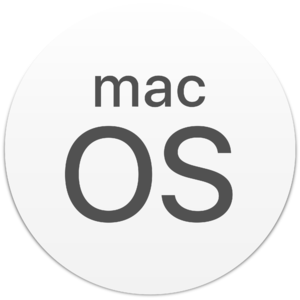

## Awesome MacOS Software v1.9.1

A curated list of fantastically awesome software for Apple's macOS operating system. This list was inspired by 
[Awesome Sysadmin](https://github.com/kahun/awesome-sysadmin). Legend: Open Source apps = ![Open Source][oss]. Paid 
apps = ![Dollar][mon]. If an app dosen't have either icon then it should be considered free. 

- [Academics](#academics)
- [Anti-Virus](#anti-virus)
- [Application Launchers](#application-launchers)
- [Audio Players](#audio-players)
- [Audio Utilities](#audio-utilities)
- [Backups](#backups)
- [Calendar Applications](#calendar-applications)
- [Cleanup](#cleanup)
- [Clipboard Managers](#clipboard-managers)
- [Cloud Storage](#cloud-storage)
- [Code Editors](#code-editors)
- [Color Pickers](#color-pickers)
- [Communication](#communication)
- [Compression](#compression)
- [Databases](#databases)
- [Design](#design)
- [DevOps](#devops)
- [Encryption](#encryption)
- [Email](#email)
- [Electronic Books](#electronic-books)
- [File Synchronization](#file-synchronization)
- [File Management](#file-management)
- [Fonts](#fonts)
- [FTP Clients](#ftp-clients)
- [Games](#games)
- [Graphics](#graphics)
- [Image Editors](#image-editors)
- [Image Viewers](#image-viewers)
- [Internet](#internet)
- [IRC Clients](#irc-clients)
- [Journaling](#journaling)
- [Knowledge Management](#knowledge-management)
- [Markdown Editors](#markdown-editors)
- [Menubar Applications](#menubar-applications)
- [Messenger Applications](#messenger-applications)
- [Miscellaneous](#miscellaneous)
- [Networking Applications](#networking-applications)
- [Notes](#notes)
- [Office Suites](#office-suites)
- [Package Management](#package-management)
- [Painting Applications](#painting-applications)
- [Password Management](#password-management)
- [Productivity](#productivity)
- [Programming Languages](#programming-languages)
- [Programming Utilities](#programming-utilities)
- [Remote Administration](#remote-administration)
- [Science](#science)
- [Screen Savers](#screen-savers)
- [Security](#security)
- [Search Utilities](#search-utilities)
- [Social Media](#social-media)
- [Source Control](#source-control)
- [System Maintenance](#system-maintenance)
- [System Tools](#system-tools)
- [Task Management](#task-management)
- [Terminal](#terminal)
- [Text Editors](#text-editors)
- [Text Expanders](#text-expanders)
- [Web Browsers](#web-browsers)
- [Windows Managers](#windows-managers)
- [Writing Apps](#writing)
- [Video Utilities](#video-utilities)
- [Virtualization](#virtualization)

## Academics

- [Manuscripts](http://www.manuscriptsapp.com/) - A writing tool like nothing you have seen before.
- [Mochi](https://mochi.cards/) - Take notes and make flashcards.
- [Numi](http://numi.io/) - Beautiful calculator app for Mac. ![Dollar][mon]
- [Studies](http://www.studiesapp.com/) - Master Your Studies. ![Dollar][mon]

## Anti-Virus

- [Avast Security for Mac](https://www.avast.com/free-mac-security) - Think different about Mac security. Free & ![Dollar][mon]
- [AVG AntiVirus for Mac](https://www.avg.com/en-us/avg-antivirus-for-mac) - Simply safer with AVG AntiVirus for Mac. Free & ![Dollar][mon]
- [Bitdefender Antivirus](https://www.bitdefender.com/solutions/free.html) - Absolute antivirus protection. Free & ![Dollar][mon]
- [Malwarebytes](https://www.malwarebytes.com/mac/) - Adware removal tool. Free & ![Dollar][mon]
- [Webroot AntiVirus](https://www.webroot.com/us/en/home/products/av) - Full-scale antivirus program. ![Dollar][mon]

## Application Launchers

- [Alfred](https://www.alfredapp.com/) - Search your Mac and the web effortlessly, and control your Mac. Free & ![Dollar][mon]
- [LaunchBar](https://www.obdev.at/products/launchbar/index.html) - Powerful file/URL/email launcher utility. ![Dollar][mon]
- [Launchey 2](https://www.getniceapps.com/launchey-2) - Lightweight menu bar app launcher. ![Dollar][mon]
- [Overflow](https://stuntsoftware.com/overflow/) - The visual launcher for your Mac. ![Dollar][mon]
- [Recents for Mac](https://recentsapp.com/) - Find files faster.
- [Slik](https://apps.inspira.io/en/slik/) - Fast app launcher and web app organizer. ![Dollar][mon]
- [Start](https://start.innovative-bytes.net/) - A superior way to launch applications. ![Dollar][mon]
- [Quicksilver](https://qsapp.com/) - Application launcher and much more. ![Open Source][oss]
- [Ueli](https://ueli.app) - A keystroke launcher for Windows and macOS. ![Open Source][oss]
- [Zazu](http://zazuapp.org) - A fully extensible and open source launcher for hackers, creators and dabblers. ![Open Source][oss]
- [Raycast](https://raycast.com/) - Control your tools with a few keystrokes. It’s designed to keep you focused. 

## Audio Players

- [Auryo](https://auryo.com/) - A SoundCloud client for your desktop. ![Open Source][oss]
- [BitPerfect](http://bitperfectsound.com/) - The Audiophile Choice. ![Dollar][mon]
- [Cog](http://cogx.org/) - Audio player similar to Foobar 2000. ![Open Source][oss]
- [Foobar2000](https://foobar2000.org/mac) - Freeware audio player for macOS.
- [Harmony](http://getharmony.xyz/) - Music player for Spotify, SoundCloud, Google Play and your local files. ![Dollar][mon]
- [Idagio](https://about.idagio.com) - Streaming, reinvented for classical music.
- [Mous](https://github.com/bsdelf/mous) - Powerful audio player & converter for FreeBSD/Linux/macOS. ![Open Source][oss]
- [Phonix](https://phonix.nl.eu.org/) - Free music player for macOS. ![Open Source][oss]
- [SIDPLAY](http://www.sidmusic.org/sidplay/mac/) - A Commodore 64 music player. ![Open Source][oss]
- [Sonos](https://www.sonos.com) - Wireless Home Sound System.
- [Soundcleod](https://soundcleod.com/) - SoundCloud for macOS. ![Open Source][oss]
- [Swinsian](https://swinsian.com/) - The Advanced Music Player for Mac. ![Dollar][mon]
- [Tidal](https://offer.tidal.com/download) - Music streaming service.
- [Tiny Player](http://www.catnapgames.com/tiny-player-for-mac/) - Tiny FLAC/AAC/MP3/WAV Player.
- [Vox](https://vox.rocks/) - Vox Music Player for macOS. 
- [Winds](https://getstream.io/winds/) - A Beautiful Open Source RSS & Podcast App. ![Open Source][oss]

## Audio Utilities

- [AirFoil](https://rogueamoeba.com/airfoil/) - Hear Your Audio Everywhere. ![Dollar][mon]
- [Audio Hijack](https://rogueamoeba.com/audiohijack/) - Record any audio. ![Dollar][mon]
- [BlackHole](https://existential.audio/blackhole/) - Route Audio Between Apps. ![Open Source][oss]
- [Dexed](https://github.com/asb2m10/dexed) - DX7 FM multi plaform/multi format plugin. ![Open Source][oss]
- [eqMac2](https://github.com/nodeful/eqMac2) - System-Wide Equalizer for the Mac. ![Open Source][oss]
- [Farrago](https://rogueamoeba.com/farrago/) - Robust, rapid-fire soundboards. ![Dollar][mon]
- [Fission](https://rogueamoeba.com/fission/) - Fast & lossless audio editing. ![Dollar][mon]
- [Kid3](https://kid3.kde.org/) - Audio Tagger. ![Open Source][oss]
- [Loopback](https://rogueamoeba.com/loopback/) - Cable-free audio routing for Mac. ![Dollar][mon]
- [Metadatics](http://www.markvapps.com/metadatics) - Audio metadata editor. ![Dollar][mon]
- [Mutify](https://mutify.app/) - Quickly mute your microphone. ![Dollar][mon]
- [ocenaudio](https://www.ocenaudio.com/en) - Easy, fast and powerful audio editor
- [Piezo](https://rogueamoeba.com/piezo/) - Charmingly simple audio recording. ![Dollar][mon]
- [Roon](https://roonlabs.com/) - The Ultimate Music Player for Music Fanatics. ![Dollar][mon]
- [Samplr for Touchbar](http://samplr.net/touchbar/) - Demo of Samplr for the MacBook Touch Bar.
- [ShazamScrobbler](https://github.com/ShazamScrobbler/shazamscrobbler-macos) - Last.fm scrobbler for the Shazam Mac app. ![Open Source][oss]
- [Sound Source](https://rogueamoeba.com/soundsource/) - Superior Sound Control. ![Dollar][mon]
- [Tickeys](https://github.com/yingDev/Tickeys) - Audio feedback while typing. ![Open Source][oss] 
- [TunesArt](https://www.jibapps.com/apps/tunesart/) - Display a gorgeous album cover on your desktop. ![Dollar][mon]
- [X Lossless Decoder](http://tmkk.undo.jp/xld/index_e.html) - Decode/Convert to and from dozens of audio file types.

## Backups

- [Arq](https://www.arqbackup.com/) - Backup your files to Google Drive, Amazon Glacier, SFTP, and more. ![Dollar][mon]
- [Arq Cloud Backup](https://www.arqbackup.com/arqcloudbackup/) - Backs up all your files automatically. ![Dollar][mon]
- [Carbon Copy Cloner](http://bombich.com/) - Create a bit-perfect clone of your Mac's hard drive. ![Dollar][mon]
- [Freeze](https://www.freezeapp.net/) - Amazon Glacier for your Mac. ![Dollar][mon]
- [Macrium Reflect 7](https://www.macrium.com/reflectfree) - Free back up, disk imaging, and cloning solution.
- [Rclone](http://rclone.org/) - Sync files and directories to and from multiple services. ![Open Source][oss]

## Calendar Applications

- [BusyCal 3](https://busymac.com/busycal) - Powerful calendar app for macOS. ![Dollar][mon]
- [Day-O](https://shauninman.com/archive/2016/10/20/day_o_2_mac_menu_bar_clock) - Simple menu bar clock replacement.
- [Fantastical](https://flexibits.com/fantastical) - The calendar app you won't be able to live without. ![Dollar][mon]
- [Informant](https://www.pocketinformant.com/products/mac-organizer-app/) - The best calendar app for macOS. ![Dollar][mon]
- [Itsycal](http://www.mowglii.com/itsycal/) - Itsycal is a tiny calendar for your Mac's menu bar. ![Open Source][oss]

## Cleanup

- [BlueHarvest](https://zeroonetwenty.com/blueharvest/) - Keep your disks clean of macOS metadata. ![Dollar][mon]
- [Clean-Me](https://github.com/Kevin-De-Koninck/Clean-Me) - A macOS system analyser and cleaner.
- [Daisy Disk](https://daisydiskapp.com/) - What’s taking up your disk space? ![Dollar][mon]
- [Disk Doctor](https://fiplab.com/apps/disk-doctor-for-mac) - Removes tons of unneeded files. ![Dollar][mon]
- [Duplicate Detective](https://fiplab.com/apps/duplicate-detective-for-mac) - Remove duplicate files from your Mac. ![Dollar][mon]
- [Monolingual](http://ingmarstein.github.io/Monolingual/) - Frees up disk space by removing unused languages files. ![Open Source][oss]
- [TrashMe](http://www.jibapps.com/en/products/trashme/) - Uninstaller for the Mac with other great useful tools. ![Dollar][mon]

## Clipboard Managers

- [Copied](https://copied.app/) - Clipboard manager for macOS, iOS and iPadOS. ![Dollar][mon] 

## Cloud Storage

- [Box Sync](https://www.box.com/personal) - Online synchronization tool. Free & ![Dollar][mon]
- [Dropbox](https://www.dropbox.com) - Cloud backup and synchronization tool. Free & ![Dollar][mon]
- [Google Drive](https://www.google.com/drive/) - Easy and secure access to all of your content. Free & ![Dollar][mon]
- [Mega](https://mega.nz/startpage) - Secure Cloud Storage and Communication. ![Dollar][mon]
- [OmniPresence](https://www.omnigroup.com/more) - Document syncing for iOS & macOS.
- [Rsync Client](http://bonhardcomputing.com/rsync-client/) - A simple GUI for managing your remote files. ![Dollar][mon]
- [Rsync Server](http://bonhardcomputing.com/rsync-server/) - Enable the Rsync service on your Mac. ![Dollar][mon]
- [Syncthing](https://syncthing.net/) - Replaces proprietary sync and cloud services. ![Open Source][oss]

## Code Editors

- [AppCode](https://www.jetbrains.com/objc/) - Smart IDE for iOS/macOS development. ![Dollar][mon]
- [Atom](https://atom.io/) - A hackable text editor for the 21st Century. ![Open Source][oss]
- [Arduino IDE](https://www.arduino.cc/en/Main/Software) - Open-source Arduino Code Editor. ![Open Source][oss]
- [BBedit](http://www.barebones.com/products/bbedit/) - The text editor that doesn't suck. ![Dollar][mon]
- [Brackets](http://brackets.io/) - Open source text editor that understands web design. ![Open Source][oss]
- [CLion](https://www.jetbrains.com/clion/) - A cross-platform IDE for C and C++. ![Dollar][mon] 
- [Coda](https://www.panic.com/coda/) - One-window Web development suite. ![Dollar][mon]
- [CodeRunner 2](https://coderunnerapp.com/) - Easy-to-use programming editor for your Mac. ![Dollar][mon]
- [Espresso](https://espressoapp.com/) - Powerful HTML, XML, CSS, and JavaScript development tool. ![Dollar][mon] 
- [IntelliJ](https://www.jetbrains.com/idea/) - Capable and Intelligent IDE. ![Dollar][mon] 
- [RubyMine](https://www.jetbrains.com/ruby/) - Work Faster with a Smarter Editor. ![Dollar][mon]
- [SubEthaEdit 5](https://subethaedit.net/) - Code, Write, Edit. Together. ![Open Source][oss]
- [Sublime Text](https://www.sublimetext.com/) - A sophisticated text editor for code, markup and prose. ![Dollar][mon]
- [Textmate](https://github.com/textmate/textmate) - Powerful and customizable text editor. ![Open Source][oss]
- [VimR](https://github.com/qvacua/vimr) - Neovim GUI for macOS. ![Open Source][oss]
- [Visual Studio Code](https://code.visualstudio.com/) - Excellent cross-platform text editor from Microsoft. ![Open Source][oss]
- [Xcode](https://developer.apple.com/xcode/) - Apple's Swift/Objective-C development environment.
- [HMScriptEditor](https://zeezide.de/en/products/hmscripteditor/) - Code editor for HomeMatic scripts. ![Dollar][mon]

## Color Pickers

- [Couleurs](http://couleursapp.com/) - A simple but powerful color grabber.
- [Color Picker Plus](https://github.com/viktorstrate/color-picker-plus) - An Improved Color Picker for macOS. ![Open Source][oss]
- [ColorSlurp](http://colorslurp.com/) - The best Mac color picker in the universe!
- [ColorSnapper 2](https://colorsnapper.com/) - Organize, adjust & export colors with style. ![Dollar][mon] 
- [ColorWell](https://colorwell.sweetpproductions.com/) - macOS Color Theme generator. ![Dollar][mon]
- [Pastel](https://apps.apple.com/us/app/id413897608) - Beautiful color palettes. 
- [Sip](http://sipapp.io/) - Collect, organize & share your colors. ![Dollar][mon]

## Communication

- [Aether](https://getaether.net/) - Peer-to-peer ephemeral public communities. ![Open Source][oss]
- [Chime](https://chime.aws/) - Amazon Chime communications service. ![Dollar][mon]
- [Feishu](https://www.feishu.cn/en/) - The Only All-in-One Platform You Will Ever Need.
- [Loom](https://www.loom.com/) - Take back your time.
- [Screen](https://screen.so/#/home) - Work together like you’re in the same room.
- [Slack](https://slack.com/) - Team-based collaboration tool.
- [Workplace by Facebook](https://www.facebook.com/workplace) - Change the way you work.
- [Zulip](https://github.com/zulip/zulip-desktop) - Zulip for macOS. ![Open Source][oss]

## Compression

- [Keka](https://www.keka.io/en/) - MacOS file archiver. Store more, share with privacy. ![Open Source][oss]
- [The Unarchiver](http://unarchiver.c3.cx/unarchiver) - Capable replacement for MacOS' default compression app.
- [p7zip](http://p7zip.sourceforge.net/) - Open Source port of 7-Zip for POSIX systems. ![Open Source][oss]
- [Zip Cleaner](https://roger-jolly.nl/software/#zipcleaner) - Remove DS_Store, Icon^M and __MACOSX from archives. ![Open Source][oss]

## Databases

- [Azure Data Studio](https://docs.microsoft.com/en-us/sql/azure-data-studio) - SQL client based on Visual Studio Code.
- [Bdash](https://www.bdash.io/) - Simple SQL Client for lightweight data analysis. ![Open Source][oss]
- [Beekeeper Studio](https://www.beekeeperstudio.io/) - Open Source SQL Editor and Database Manager.
- [DBeaver](http://dbeaver.jkiss.org/) - Free Universal SQL Client. ![Open Source][oss]
- [DB Browser for SQLite](https://github.com/sqlitebrowser/sqlitebrowser) - SQLite Database Browser. ![Open Source][oss]
- [Mongotron](http://mongotron.io/#/) - Cross platform MongoDB management. ![Open Source][oss]
- [Sequel Pro](http://www.sequelpro.com/) - A MySQL database manager. ![Open Source][oss]
- [pgweb](http://sosedoff.github.io/pgweb/) - Cross-platform client for PostgreSQL databases. ![Open Source][oss]
- [Postbird](https://github.com/paxa/postbird) - Open source PostgreSQL GUI client for macOs. ![Open Source][oss]
- [Postgres.app](http://postgresapp.com/) - PostgreSQL for MacOS. ![Open Source][oss]
- [Postico](https://eggerapps.at/postico/) - A Modern PostgreSQL Client for the Mac.
- [PSequel](http://www.psequel.com/) - PostgreSQL GUI tool for macOS. ![Open Source][oss]
- [Robomongo](https://robomongo.org/) - Cross-platform MongoDB client.
- [TablePlus](https://tableplus.com/) - Modern GUI for MySQL, PostgreSQL, and SQLite. ![Dollar][mon]

## Design

- [Origami Studio](https://origami.design/) - Explore, iterate, and test your ideas.
- [Sketch](https://www.sketchapp.com/) - Professional digital design for Mac. ![Dollar][mon]
- [Zeplin](https://zeplin.io/) - Build pixel perfect apps in peace.

## DevOps

- [Captain](https://getcaptain.co) - Manage Docker containers. Free.
- [Container PS](https://github.com/Toinane/container-ps) - Menu Bar app for Docker. ![Open Source][oss]
- [Docker Desktop](https://www.docker.com/products/docker-desktop) - The world’s leading software containerization platform.
- [Kitematic](https://kitematic.com/) - Run containers through a GUI. ![Open Source][oss]

## Encryption

- [Cryptomator](https://cryptomator.org/) - Free client-side encryption for your cloud files. ![Open Source][oss]
- [GPG Tools](https://gpgtools.org/) - GPG Suite for macOS. ![Open Source][oss]
- [keys.pub](https://keys.pub/) - Manage cryptographic keys, sigchains and user identities. ![Open Source][oss]
- [Keybase](https://keybase.io/) - Keybase is a directory of public keys and the proofs of who owns them. ![Open Source][oss]

## Email

- [Canary](https://canarymail.io/) - Secure Email App for Mac and iPhone. ![Dollar][mon]
- [eM Client](https://www.emclient.com) - Boost your email. Skyrocket your productivity. Free & ![Dollar][mon]
- [MailMate](https://freron.com/) - IMAP email client for macOS. ![Dollar][mon]
- [Polymail](https://polymail.io/) - Simple, beautiful, powerful e-mail. ![Dollar][mon]
- [Postbox](https://www.postbox-inc.com/) - Powerful and flexible email client. ![Dollar][mon]
- [Spark](https://sparkmailapp.com/) - Email client for Apple devices.
- [Thunderbird](https://www.mozilla.org/en-US/thunderbird/) - Cross-platform e-mail and news (NNTP) client. ![Open Source][oss]

## Electronic Books

- [Bookpedia](https://www.bruji.com/bookpedia/) - What's on your shelves? ![Dollar][mon]
- [Calibre](http://calibre-ebook.com/) - Complete e-book library management system. ![Open Source][oss]
- [Delicious Library 3](https://www.delicious-monster.com/) - Book Manager. ![Dollar][mon]
- [Kindle](https://www.amazon.com/kindle-dbs/fd/kcp) - Read Kindle books on your Mac.
- [Kitabu](https://www.kitabu.me/) - Kitabu is your EPUB reading application and cloud library.

## File Synchronization

- [Box](https://www.box.com/personal) - Online synchronization tool for box.net. ![Dollar][mon]
- [Dropbox](https://www.dropbox.com/) - Cloud backup and synchronization tool. ![Dollar][mon]
- [Google Drive](https://tools.google.com/dlpage/drive/index.html?pli=1) - File backup and sharing tool. ![Dollar][mon]
- [oDrive](https://www.odrive.com/) - Make Cloud Storage the way it should be.
- [OneDrive](https://onedrive.live.com) - Access your Microsoft OneDrive. ![Dollar][mon]

## File Management

- [Commander One](https://mac.eltima.com/file-manager.html) - Dual-pane file manager for macOS.
- [CRAX Commander](https://crax.soft4u2.com/) - Dual-pane and multi-tabbed file manager. ![Dollar][mon]
- [Cryo](https://cryonet.io/) - Visual peer-to-peer file manager.
- [DCommander](https://devstorm-apps.com/dc/) - Advanced file manager for Mac. ![Dollar][mon]
- [ForkLift 3](http://binarynights.com/forklift/) - Advanced dual-pane FTP/file manager. ![Dollar][mon]
- [Gemini](https://macpaw.com/gemini) - The intelligent duplicate file finder. ![Dollar][mon]
- [Hazel](https://www.noodlesoft.com/) - Automated Organization for Your Mac. ![Dollar][mon]
- [Marta](https://marta.yanex.org/) - File Manager for macOS. 
- [Mountain Duck](https://mountainduck.io/) - Cyberduck for mounting volumes in the file explorer. ![Dollar][mon]
- [NameChanger](https://mrrsoftware.com/namechanger/) - Rename a list of files quickly and easily.
- [Path Finder](https://cocoatech.com) - Powerful, award-winning Finder alternative. ![Dollar][mon]
- [TotalFinder](https://totalfinder.binaryage.com/) - For Mac users who demand more from their Finder. ![Dollar][mon]
- [Trickster](https://www.apparentsoft.com/trickster) - Your recently used files, at your fingertips. ![Dollar][mon]
- [fman](https://fman.io/) - Dual-pane file manager for Mac. ![Dollar][mon]

## Fonts

- [FontForge](https://fontforge.org/en-US/) - Free and open source font editor. ![Open Source][oss]

## FTP Clients

- [Cyberduck](https://cyberduck.io/) - A libre server and cloud storage browser for Mac.
- [FileZilla](https://filezilla-project.org/) - Open source FTP client. ![Open Source][oss]
- [Transmit](https://www.panic.com/transmit/) - FTP client that supports SFTP, S3, WebDAV, and more. ![Dollar][mon]
- [Viper FTP](https://viperftp.com/) - Simple, user-friendly yet powerful FTP client for Mac. ![Dollar][mon]

## Games

- [Doomseeker](https://doomseeker.drdteam.org/) - Cross-platform server browser for Doom.
- [DOSBox](https://www.dosbox.com) - DOS emulation for macOS.
- [Epic Games Launcher](https://www.epicgames.com/store) - Game client.
- [GZDoom](https://zdoom.org/index) - A Doom source port for the modern era. ![Open Source][oss]
- [OpenEmu](https://openemu.org/) - Video game emulation. ![Open Source][oss]
- [ReDoomEd](http://twilightedge.com/mac/redoomed/) - Port of “DoomEd”, id Software’s Doom map editor for NeXTSTEP (1993).
- [Rolisteam](https://rolisteam.org/) - Manage tabletop role playing games with remote friends/players. ![Open Source][oss]
- [Slade](http://slade.mancubus.net) - A modern editor for Doom.
- [Zandronum](https://zandronum.com/) - Leading the way in newschool multiplayer Doom online.

## Graphics

- [Adapter](https://macroplant.com/adapter) - Adapter Converts Video, Audio and Images.
- [Amadine](https://amadine.com/) - The ultimate vector graphics software for macOS. ![Dollar][mon] 
- [CleanShot](https://cleanshot.com/) - Capture your Mac’s screen like a pro. ![Dollar][mon]
- [Gifox](https://gifox.io/) - Delightful GIF Recording and Sharing App.
- [Icon Jar](https://geticonjar.com) - Store all your icons in one place. ![Dollar][mon]
- [ImageOptim](https://imageoptim.com/mac) - Removes bloated metadata. ![Open Source][oss]
- [Image2icon](http://www.img2icnsapp.com/) - Create and personalize icons from your pictures.
- [Kap](https://getkap.co/) - Capture your screen. ![Open Source][oss]
- [Ruffle](https://ruffle.rs/) - A Flash Player emulator built with Rust. ![Open Source][oss]
- [Storyboarder](https://wonderunit.com/storyboarder/) - The best way to visualize your story.

## Image Editors

- [Affinity Photo](https://affinity.serif.com/en-us/photo/) - The first choice for photography and creative professionals. ![Dollar][mon]
- [GIMP](https://www.gimp.org/) - GNU Image Manipulation Program. ![Open Source][oss]
- [Pixelmator](http://www.pixelmator.com) - Full-featured image editor for Mac. ![Dollar][mon]
- [Pixelmator Pro](https://www.pixelmator.com/pro/) - Professional image editor. ![Dollar][mon]
- [PhotoMD](https://apps.apple.com/us/app/photomd/id1515646480?mt=12) - Image EXIF and metadata editor, viewer and sorter. ![Dollar][mon]
- [Seashore](https://github.com/robaho/seashore) - Easy to use mac osx image editing application. ![Open Source][oss]

## Image Viewers

- [Eagle](https://eagle.cool/) - Photo viewer, manager, and organizer. ![Dollar][mon]
- [Lyn](https://www.lynapp.com/) - Organize, view, edit and share your photos. ![Dollar][mon]
- [Phew](https://sveinbjorn.org/phew) - An open-source FLIF image viewer and QuickLook plugin for macOS. ![Open Source][oss]
- [Phiewer](https://phiewer.com/) - The easiest and fastest way to view your images.
- [PikoPixel](http://twilightedge.com/mac/pikopixel/) -  Pixel-art editor. ![Open Source][oss]
- [PhotoMD-lite](https://apps.apple.com/us/app/photomd-lite/id1519298602?mt=12) - View images and EXIF and metadata.
- [Pixave](http://www.littlehj.com/mac/) - The ultimate image viewer and organizer. ![Dollar][mon]
- [qView](https://github.com/jurplel/qView) - Practical and minimal image viewer. ![Open Source][oss]
- [Spect](http://spect-app.com/) - Fast image browser and organizer. ![Dollar][mon]
- [Xee](https://theunarchiver.com/xee) - Super fast image viewer. ![Dollar][mon]

## Internet

- [Castor](https://sr.ht/~julienxx/Castor/) - A Browser for the small internet (Gemini, Gopher, Finger). ![Open Source][oss]
- [Charles](https://www.charlesproxy.com/) - HTTP proxy, HTTP monitor, Reverse Proxy.
- [DomainBrain](https://domainbrainapp.com/) - Track of server and login information for websites. ![Dollar][mon]
- [Freenet](https://freenetproject.org/) - Peer-to-peer platform for censorship-resistant communication and publishing. ![Open Source][oss]
- [Kristall](https://github.com/MasterQ32/kristall) - GUI client for MacOS for gemini, http, https, gopher, finger. ![Open Source][oss]

## IRC Clients

- [HexChat](https://hexchat.github.io/) - IRC client based on XChat. ![Open Source][oss]
- [Irssi](https://irssi.org/) - Your text mode chatting application since 1999. ![Open Source][oss]
- [KVIrc](http://kvirc.net/) - QT IRC Client. ![Open Source][oss]
- [LimeChat](http://limechat.net/mac/) - LimeChat is an IRC client for MacOS. ![Open Source][oss]
- [Textual](https://github.com/Codeux-Software/Textual) - Lightweight IRC client. ![Open Source][oss] ![Dollar][mon]
- [Smuxi](https://smuxi.im/) - GTK+ multi-service ITC client. ![Open Source][oss]

## Journaling

- [Day One](http://dayoneapp.com/) - A journal, diary, text-logging application. ![Dollar][mon]
- [jrnl](http://jrnl.sh/) - Command-line journaling application. ![Open Source][oss]
- [MacJournal 7](http://danschimpf.com/) - macOS journaling application.

## Knowledge Management

- [DEVONthink](https://www.devontechnologies.com/apps/devonthink) - Document/Note manager. ![Dollar][mon]
- [DEVONsphere Express](https://www.devontechnologies.com/products/devonsphere/devonsphere-express.html) ![Dollar][mon]
- [FSNotes](https://github.com/glushchenko/fsnotes) - Notes manager for macOS. ![Open Source][oss]
- [Keep It](https://reinventedsoftware.com/keepit/) - Write notes, keep things, and find them again. ![Dollar][mon]
- [Notion](https://www.notion.so) - Write, plan, collaborate, and get organized. ![Open Source][oss]
- [OneNote](http://www.onenote.com/) - Note manager from Microsoft.
- [Yojimbo](http://www.barebones.com/products/Yojimbo/) - Effortless, reliable information organizer for macOS. ![Dollar][mon]

## Markdown Editors

- [Byword](http://www.bywordapp.com/) - Excellent markdown editor. ![Dollar][mon]
- [Notable](https://github.com/fabiospampinato/notable) - Markdown-based note-taking app that doesn't suck. ![Open Source][oss]
- [MacDown](http://macdown.uranusjr.com/) - Open source Markdown editor for MacOS. ![Open Source][oss]
- [Mark Text](https://marktext.app/) - Simple and Elegant cross platform Markdown Editor.
- [MWeb](http://www.mweb.im/) - Pro Markdown writing and note taking editor. ![Dollar][mon]
- [Pine](https://lukakerr.github.io/Pine/) - Native markdown editor for macOS. ![Open Source][oss]
- [Texts](http://www.texts.io/) - Separate Content from Formatting. Store in Markdown.
- [Typora](https://www.typora.io/) - Live markdown reader and a writer.
- [vnote](https://github.com/tamlok/vnote) - A Vim-inspired Markdown note-taking application. ![Open Source][oss]

## Menubar Applications

- [Apple Juice](https://github.com/raphaelhanneken/apple-juice) -  Advanced battery gauge for macOS. ![Open Source][oss]
- [BitBar](https://www.getbidbar.com/) - Run terminal commands from the menu bar. ![Open Source][oss]
- [FuzzyClock](https://github.com/m-schmidt/FuzzyClock) - Displays the time in your menubar. ![Open Source][oss]
- [Hidden Bar](https://github.com/dwarvesf/hidden) - Lets you hide menu bar items. ![Open Source][oss]
- [KeyCue](https://www.ergonis.com/products/keycue/) - Find, remember, and learn keyboard shortcuts. ![Dollar][mon]
- [NightOwl](https://nightowl.kramser.xyz/#) - Easily toggle dark mode on macOS. ![Open Source][oss]
- [MenuBar Stats 3](https://seense.com/menubarstats/) - Advanced macOS System Monitor. ![Dollar][mon]
- [Meteorologist](https://sourceforge.net/projects/heat-meteo/) -  Free weather program for macOS. ![Open Source][oss]
- [Shifty](https://shifty.natethompson.io/en/) - A menu bar app that gives you more control over Night Shift. ![Open Source][oss]
- [Stats](https://github.com/exelban/stats) - Simple macOS system monitor in your menu bar. ![Open Source][oss]
- [Tyke](https://tyke.app/) - A little bit of scratch paper.
- [Vanilla](http://matthewpalmer.net/vanilla/) - Hide menu bar icons on your Mac.
- [WhichSpace](https://github.com/gechr/WhichSpace) - Active space menu bar icon for macOS. ![Open Source][oss]
- [XMenu](https://www.devontechnologies.com/apps/freeware) - Directly access all your apps from the manu bar.

## Messenger Applications

- [Cabal](https://cabal.chat/) - Experimental p2p community chat platform.
- [Caprine](https://github.com/sindresorhus/caprine) - Elegant Facebook-Messenger client. ![Open Source][oss]
- [Discord](https://discordapp.com/) - Free Voice and Text Chat for Gamers. ![Open Source][oss]
- [Gitter](https://gitter.im/) - A chat and networking platform. ![Open Source][oss]
- [Keybase Chat](https://keybase.io/download) - Crypto chat for everyone. ![Open Source][oss]    
- [Monal](https://monal.im/) - Secure XMPP chat client. ![Open Source][oss]
- [Patchwork](https://github.com/ssbc/patchwork) - Decentralized messaging app built on top of Secure Scuttlebutt (SSB). ![Open Source][oss]
- [Ripcord](https://cancel.fm/ripcord/) - Desktop chat client for Slack (and Discord). ![Dollar][mon]
- [Signal](https://www.signal.org/) - Fast, simple, secure. ![Open Source][oss]
- [Shrugs](https://shrugs.app/) - Desktop chat client for Slack. ![Dollar][mon]
- [Telegram](https://itunes.apple.com/us/app/messenger-for-telegram/id747648890) - Secure messaging app. ![Open Source][oss]
- [Tox](https://tox.chat/) - A New Kind of Instant Messaging. ![Open Source][oss]
- [Wire](https://wire.com/en/) - Secure communication. Full privacy. ![Open Source][oss]

## Miscellaneous

- [AnyBar](https://github.com/tonsky/AnyBar) - macOS menubar status indicator. ![Open Source][oss]
- [AirParrot](https://www.airsquirrels.com/airparrot/) - Streaming and Mirroring for macOS. ![Dollar][mon]
- [CodeCows](https://zeezide.de/en/products/codecows/) - Inject hundreds of ASCII Cows in any app.
- [Console](https://github.com/macmade/Console) - Replacement macOS console application. ![Open Source][oss]
- [Contexts](https://contexts.co/) - Radically simpler & faster window switcher.
- [FS-UAE](https://fs-uae.net/) - Amiga Emulator. ![Open Source][oss]
- [Glance](https://github.com/samuelmeuli/glance) - All-in-one Quick Look plugin. ![Open Source][oss]
- [Hackintool](https://github.com/headkaze/Hackintool) - The Swiss army knife of vanilla Hackintoshing. ![Open Source][oss]
- [ha-menu](https://github.com/codechimp-org/ha-menu/) - Perform common Home Assistant functions. ![Open Source][oss]
- [Kinto](https://github.com/rbreaves/kinto) -  Linux & Windows keyboard layout for macOS users. ![Open Source][oss]
- [Mactracker](https://mactracker.ca/) - Detailed information on every Apple product.
- [Micro.blog](https://s3.amazonaws.com/micro.blog/mac/Micro.blog_1.9.zip) - The official macOS version of Micro.blog.
- [Middle](https://middleclick.app/) - Add middle click to your Mac. ![Dollar][mon]
- [NetNewsWire](https://ranchero.com/netnewswire/) - More news, less junk. Faster.
- [PiBakery](https://www.pibakery.org/) - The easiest way to setup a Raspberry Pi.
- [Reeder](https://www.reederapp.com/mac/) - The best news reader for macOS. ![Dollar][mon]
- [Tickeys](https://github.com/yingDev/Tickeys) - Instant audio feedback for typing. macOS version. ![Open Source][oss]
- [ResXtreme](http://resxtreme.com/) - Provides access to all display modes. ![Dollar][mon]
- [RightFont 5](https://rightfontapp.com/) - Professional font manager app for Mac. ![Dollar][mon]
- [Sugarmate](https://sugarmate.io/) - A new way to manage your diabetes. 
- [Swish](https://highlyopinionated.co/swish/) - The missing gesture layer for macOS. ![Dollar][mon]
- [Unison](https://download.panic.com/unison/Unison%202.2.zip) - Excellent MacOS app for accessing Usenet Newsgroups.
- [Wintertime](https://github.com/actuallymentor/wintertime-mac-background-freezer) - Background App Freezer for macOS. ![Open Source][oss]

## Networking Applications

- [Airtool](https://www.intuitibits.com/products/airtool/) - Capture Wi-Fi traffic Like a Pro.
- [Angry IP Scanner](https://angryip.org/) - Cross-platform network scanner. ![Open Source][oss]
- [Caddy](https://caddyserver.com/) - The HTTP/2 web server with automatic HTTPS.
- [Core Tunnel](https://coretunnel.app/) - Tunnel management made easy. ![Dollar][mon]
- [DNSCrypt](https://github.com/alterstep/dnscrypt-osxclient) - Control the DNSCrypt Proxy. ![Open Source][oss]
- [Fenix](https://fenixwebserver.com/) - Simple static desktop web server. ![Open Source][oss]
- [iStumbler](https://istumbler.net/index.html) - Wireless Intelligence. ![Dollar][mon]
- [Murus](http://www.murusfirewall.com/) - A GUI for the MacOS PF firewall. Free & ![Dollar][mon]
- [NetSpot](https://www.netspotapp.com/) - Wireless survey tool.
- [Network Radar](https://witt-software.com/networkradar/) - Scan and monitor your network. ![Dollar][mon]
- [Shuttle](http://fitztrev.github.io/shuttle/) - A simple SSH shortcut menu for macOS. ![Open Source][oss]
- [SpechtLite](https://github.com/zhuhaow/SpechtLite) - A rule-based proxy app for macOS. ![Open Source][oss]
- [SSH Copy](https://codinn.com/products/ssh-copy/) - Manage remote files with ease. ![Dollar][mon]
- [SSH Tunnel Manager](https://www.tynsoe.org/v2/stm/) - Manage your SSH tunnels.
- [Surge](http://nssurge.com/) - Advanced Web Debugging Proxy for macOS & iOS. ![Dollar][mon]
- [SwitchHosts](https://oldj.github.io/SwitchHosts/) - Hosts management & switching. ![Open Source][oss]
- [Transmission](https://transmissionbt.com/download/) - Easy, free BitTorrent client. ![Open Source][oss]
- [Transfer](https://www.intuitibits.com/products/transfer/) - TFTP server for your Mac. ![Dollar][mon]
- [Usenapp](https://www.usenapp.com/) - The most complete usenet client for macOS. ![Dollar][mon]
- [WebTorrent](https://webtorrent.io/desktop/) - Streaming torrent app.
- [WhatRoute](https://www.whatroute.net/) - Graphical IP tracer.
- [WiFi Explorer](https://www.intuitibits.com/products/wifi-explorer/) - Wi-Fi discovery and troubleshooting. ![Dollar][mon]
- [WiFi Signal](https://www.intuitibits.com/products/wifi-signal/) - Monitor your Wi-Fi connection. ![Dollar][mon]

## Notes

- [Agenda](https://agenda.com/) - Date-focused note taking
- [Milanote](https://milanote.com/) - Get organized. Stay creative.
- [QOwnNotes](https://www.qownnotes.org/) - Plain-text file markdown note taking with Nextcloud integration. ![Open Source][oss]
- [Trilium](https://github.com/zadam/trilium) - Build your personal knowledge base. ![Open Source][oss]

## Office Suites

- [Apache OpenOffice](http://www.openoffice.org/) - Apache's free and open source productivity suite. ![Open Source][oss]
- [FreeOffice](https://www.freeoffice.com/en/) - Best Microsoft Office alternative overall.
- [LibreOffice](http://www.libreoffice.org/download/libreoffice-fresh/) - A powerful, free office suite. ![Open Source][oss]
- [NeoOffice](https://www.neooffice.org) - Office suite for Mac that is based on OpenOffice and LibreOffice. ![Dollar][mon]
- [Office 365 for Mac](https://products.office.com/en-US/mac/microsoft-office-for-mac) - The latest version of Office from the folks in Redmond. ![Dollar][mon]
- [Softmaker FreeOffice](https://www.freeoffice.com/en/) - Free alternative to Microsoft Office. ![Open Source][oss]

## Package Management

- [Cakebrew](https://www.cakebrew.com/) - The Mac App for Homebrew. ![Open Source][oss]
- [Fink](http://www.finkproject.org/) - Debian package management for macOS. ![Open Source][oss]
- [Homebrew](http://brew.sh/) - The missing package manager for macOS. ![Open Source][oss]
- [MacPorts](https://www.macports.org/) - A package management system for macOS. ![Open Source][oss]
- [pkgsrc](https://www.pkgsrc.org/) - Package management system for Unix-like operating systems. ![Open Source][oss]

## Painting Applications

- [Krita](https://krita.org/en/) - A professional free and open source painting program. ![Open Source][oss]
- [Rebelle](https://www.escapemotions.com/products/rebelle/) - Paint with natural watercolors and acrylics. ![Dollar][mon]

## Password Management

- [1Password](https://agilebits.com/onepassword) - Best Password Manager out there! ![Dollar][mon]
- [Avast](https://www.avast.com/passwords-mac) - Avast Passwords for Mac.
- [Bitwarden](https://bitwarden.com/) - Solve your password management problems.
- [Buttercup](https://buttercup.pw) - The Password Manager You Deserve. ![Open Source][oss]
- [Dashlane](https://www.dashlane.com/) - Never forget another password. Free & ![Dollar][mon]
- [Elpass](https://elpass.app/) - Your all-in-one password manager. ![Dollar][mon]
- [Enpass](https://www.enpass.io/) - A secure vault for storing everything in one place. Desktop: Free. Mobile: ![Dollar][mon]
- [Force Paste](https://github.com/EugeneDae/Force-Paste) - Paste text even when not allowed. ![Open Source][oss]
- [Kaspersky Password Manager](https://usa.kaspersky.com/password-manager) - Password Manager.
- [KeepassX](https://www.keepassx.org/) - Open Source password manager. ![Open Source][oss]
- [KeePassXC](https://keepassxc.org/) - Cross-Platform password manager. ![Open Source][oss]
- [KeeWeb](https://keeweb.info/) - Password manager compatible with KeePass. ![Open Source][oss]
- [LastPass](https://www.lastpass.com/) - Simplify your life. Free & ![Dollar][mon]
- [MacPass](https://macpassapp.org/) - A native MacOS KeePass client. ![Open Source][oss]
- [Passifox](https://github.com/pfn/passifox) - Auto form-fill passwords from KeePass. ![Open Source][oss]
- [Pastor](https://mehlau.net/pastor/) - Free password manager for macOS.
- [QtPass](https://qtpass.org/) - QtPass is a multi-platform GUI for pass. ![Open Source][oss]
- [RememBear](https://www.remembear.com/) - Secure and remember all your passwords...with a Bear. ![Dollar][mon]
- [RoboForm](https://www.roboform.com/) - Protect Your Passwords. ![Dollar][mon]
- [Strongbox](https://strongboxsafe.com/) - Freemium Open Source Password Manager. ![Open Source][oss]
- [Swifty](https://getswifty.pro/) - Free & Offline Password Manager ![Open Source][oss]

## Productivity

- [Pomotroid](https://github.com/Splode/pomotroid) - Simple and visually-pleasing Pomodoro timer. 🍅 ![Open Source][oss]
- [Time Sink](https://manytricks.com/timesink/) - Track how you're spend your time. ![Dollar][mon]
- [Whale](https://github.com/1000ch/whale) - Unofficial Trello app. 🐳 ![Open Source][oss]

## Programming Languages

- [Elixir](https://elixir-lang.org/) - A dynamic, functional language. ![Open Source][oss]
- [Go](https://golang.org/) - An open source programming language from Google.
- [Janet Language](https://janet-lang.org/) - A functional and imperative programming language. ![Open Source][oss]
- [Kotlin](http://kotlinlang.org/) - Concise, simple and very easy to read (and write). ![Open Source][oss]
- [newLISP](http://www.newlisp.org/) - Lisp-like, general-purpose scripting language. ![Open Source][oss]
- [Python](https://www.python.org/) - Work quickly and integrate systems more effectively. ![Open Source][oss]
- [Ruby](https://www.ruby-lang.org/en/) - A dynamic, open source programming language. ![Open Source][oss]
- [Rust](https://www.rust-lang.org/) - A language empowering everyone. ![Open Source][oss]
- [Scratch](https://scratch.mit.edu/download) - Create your own interactive stories, games, and animations. ![Open Source][oss]
- [Swift](https://swift.org/) - A general-purpose programming language.

## Programming Utilities

- [Anvil](https://anvilformac.com/) - Menubar app for managing local websites.
- [Inkdrop](https://inkdrop.app/) - Organizing your Markdown notes made simple. ![Dollar][mon]
- [Integrity](http://peacockmedia.software/mac/integrity/free.html) - Website link checker for MacOS.
- [Flipper](https://fbflipper.com/) - Extensible mobile app debugger. ![Open Source][oss] 
- [Kaleidoscope](http://www.kaleidoscopeapp.com/) - Diff manager for MacOS. ![Dollar][mon]
- [Matcha](https://github.com/gomatcha/matcha) - Build native mobile apps in Go. ![Open Source][oss]
- [Mockoon](https://mockoon.com/) - Mock API in seconds. ![Open Source][oss]
- [Pashua](https://github.com/BlueM/Pashua) - Native macOS dialogs for scripting languages. ![Open Source][oss]
- [Paw](https://paw.cloud/) - The most advanced API tool for Mac. ![Dollar][mon]
- [Pixelsnap](https://getpixelsnap.com/) - Fastest tool for measuring anything on your screen. ![Dollar][mon]
- [Platypus](http://sveinbjorn.org/platypus) - Create MacOS applications from Bash scripts.
- [Postman](https://www.postman.com/) - Collaboration Platform for API Development.
- [Dash](https://kapeli.com/dash) - Dash gives your Mac instant offline access to 150+ API documentation sets. ![Dollar][mon]
- [Quiver](http://happenapps.com/#quiver) - The Programmer's Notebook. ![Dollar][mon]
- [SnippetsLab](http://www.renfei.org/snippets-lab/) - Easy-to-use code snippets manager. ![Dollar][mon]
- [Stoplight Studio](https://stoplight.io/studio/) - Design APIs 10x faster with our free OpenAPI editor. ![Open Source][oss]
- [SwiftPM Catalog](https://zeezide.de/en/products/swiftpmcatalog/) - Browse the Swift Package Index.
- [VueXcode](https://github.com/AlwaysRightInstitute/VueXcode/) - Enable Xcode syntax highlighting for Vue.js. ![Open Source][oss] 
- [Tinkerwell](https://tinkerwell.app/) - Run any PHP code locally. ![Dollar][mon]
- [Tinkerwell](https://tinkerwell.app/) - Run any PHP code locally. ![Dollar][mon]
- [Yo](https://github.com/sheagcraig/yo) - Send Notification Center messages from the command-line. ![Open Source][oss] 

## Remote Administration

- [AnyDesk](https://anydesk.com/en) - AnyWhere. AnyTime. AnyDesk. Free & ![Dollar][mon]
- [Jump Desktop](http://jumpdesktop.com/) - Secure RDP & VNC client. ![Dollar][mon]
- [NoMachine](https://www.nomachine.com/) - Remote desktop connections.
- [NuoRDS](https://www.nuords.com/) - Standard RDP Client software.
- [remote-desktop-manager](https://remotedesktopmanager.com/) - Remote Connections & Passwords. Everywhere! ![Dollar][mon]
- [Remotix](https://nulana.com/remotix-mac/) - Access all your computers from anywhere. ![Dollar][mon]
- [Royal TX](https://www.royalapps.com/ts/mac/features) - Comprehensive Remote Management Solution. ![Dollar][mon]
- [Screens](https://edovia.com/en/screens-mac/) - Control any computer from your Mac. ![Dollar][mon]

## Science 

- [RStudio](https://rstudio.com/) - Professional software for data science. ![Open Source][oss]
- [SciLab](https://www.scilab.org/) - Open source software for numerical computation. ![Open Source][oss]

## Screen Savers

- [Ariel](https://github.com/JohnCoates/Aerial) - Apple TV Aerial Screensaver for macOS. ![Open Source][oss]
- [Wonderful-Tools-Screensaver](https://github.com/aidev1065/Wonderful-Tools-Screensaver/) - Screensaver based on Apple's September Event 2019. ![Open Source][oss]
- [XScreenSaver](https://www.jwz.org/xscreensaver/) - Collection of free screen savers for macOS. 
 
## Search Utilities

- [Easy Find](http://www.devontechnologies.com/products/freeware.html) - Find any file on your Mac.
- [HoudahSpot 4](https://www.houdah.com/houdahSpot/) - Powerful File Search for Mac. ![Dollar][mon]
- [ProFind](https://zeroonetwenty.com/profind/) - Find like a pro. ![Dollar][mon]
- [Tembo](https://www.houdah.com/tembo/) - Friendly File Search Assistant. ![Dollar][mon]

## Security

- [Avast SecureLine VPN](https://www.avast.com/secureline-vpn#mac) - Encrypts your Internet connection. ![Dollar][mon]
- [AVG Secure VPN](https://www.avg.com/en-us/secure-vpn) - Secure your Wi-Fi and browse privately. ![Dollar][mon]
- [Do Not Disturb](https://objective-see.com/products/dnd.html) - Detects and alerts you of physical access.
- [Geph](https://geph.io/en/) - Blast through censorship!
- [Knock Knock](https://objective-see.com/products/knockknock.html) - See what's persistently installed on your Mac.
- [LuLu](https://objective-see.com/products/lulu.html) - Open-source macOS firewall.
- [Netiquette](https://objective-see.com/products/netiquette.html) - A network monitor.
- [OverSight](https://objective-see.com/products/oversight.html) - Monitors a mac's mic and webcam.
- [ProtonVPN](https://protonvpn.com/) - High-speed Swiss VPN that safeguards your privacy. ![Dollar][mon]
- [ReiKey](https://objective-see.com/products/reikey.html) - Scan and detect key loggers.
- [Santa](https://github.com/google/santa) - A binary whitelisting/blacklisting system for macOS. ![Open Source][oss]
- [Secretive](https://github.com/maxgoedjen/secretive) - Store SSH keys in the Secure Enclave. ![Open Source][oss]
- [Security Growler](https://pirate.github.io/security-growler/) - Notifies you whenever security events occur on your machine. ![Open Source][oss]
- [TaskExplorer](https://objective-see.com/products/taskexplorer.html) - Explore all the tasks (processes) running on your Mac.
- [TunnelBear](https://www.tunnelbear.com/) - A more secure way to browse the web. ![Dollar][mon]
- [Vallum](https://www.vallumfirewall.com/) - macOS Application Firewall. ![Dollar][mon]

## Social Media

- [Flume](https://flumeapp.com/) - A beautiful Instagram experience for your desktop. ![Dollar][mon]
- [Ramme](https://github.com/terkelg/ramme) - Unofficial Instagram desktop app. ![Open Source][oss]
- [Tweetbot](https://tapbots.com/tweetbot/mac/) - Popular Twitter client. ![Dollar][mon]
- [Twitterrific 5](https://twitterrific.com/mac) - Effortlessly read and compose tweets. ![Dollar][mon]
- [Whalebird](https://whalebird.org/en/desktop/contents) - A Mastodon and Pleroma client. ![Open Source][oss]
- [Mastonaut](https://mastonaut.app/) - Simple, elegant, and native Mastodon client for Mac. ![Dollar][mon]

## Source Control

- [Aurees](https://aurees.com/) - A Git client for Windows, Mac and Linux.
- [Fork](https://git-fork.com/) - A fast and friendly git client for Mac. ![Open Source][oss]
- [Fuel](https://fuel-scm.org/fossil/index) -  Front-end for the Fossil SCM. ![Open Source][oss]
- [Git Bar](https://github.com/Shikkic/gitbar) - Github contribution stats on your MacOS Menu Bar.
- [GitBlade](https://gitblade.com/) - An elegant Git client for macOS.
- [GitBox](http://gitboxapp.com/) - Version control as easy as mail. ![Dollar][mon]
- [Gitea](https://gitea.io/en-US/) - A painless self-hosted Git service. ![Open Source][oss]
- [GitFinder](https://gitfinder.com/) - A fast and lightweight Git client for Mac. ![Dollar][mon]
- [GitHub Desktop](https://desktop.github.com/) - The official GitHub client for MacOS.
- [GithubPulse](https://github.com/tadeuzagallo/GithubPulse) - Remember to contribute every day. ![Open Source][oss]
- [GitFiend](https://gitfiend.com/overview) - A Git client designed for humans.
- [GitFinder](https://gitfinder.com/) - Git client for Mac with Finder integration. ![Dollar][mon]
- [GitKraken](https://www.gitkraken.com/) - Cross-platform Git client.
- [GitPigeon](https://www.gitpigeon.com/) - GitHub notifications delivered to your Mac.
- [Gitscout](https://gitscout.com/) - A beautiful GitHub Issues experience for MacOS.
- [Gitee](https://github.com/Nightonke/Gitee) - macOS status bar application for Github. ![Open Source][oss]
- [GitX](http://gitx.frim.nl/index.html) - Git GUI made for MacOS. ![Open Source][oss]
- [SourceTree](https://www.sourcetreeapp.com/) - Easy way to work with Git and Mercurial.
- [Streaker](https://github.com/jamieweavis/streaker) - GitHub contribution streak tracking menubar app. ![Open Source][oss]
- [Thermal](https://thermal.codecarrot.net/) - All-in-one place to manage your Git repository. ![Open Source][oss]
- [Tower](http://www.git-tower.com/) - Advanced Git version control. ![Dollar][mon]
- [Xit](https://github.com/Uncommon/Xit) - macOS Git GUI. ![Open Source][oss]

## System Maintenance

- [Avast Cleanup Pro for Mac](https://www.avast.com/cleanup-mac) - Every Mac needs a clean up. Every day. ![Dollar][mon]
- [AVG TuneUp](https://www.avg.com/en-us/avg-tuneup-for-mac) - Speed up, clean up and fix your Mac. ![Dollar][mon]
- [Cocktail](https://www.maintain.se/cocktail/) - Clean, repair and optimize your Mac. ![Dollar][mon]
- [OmniDiskSweeper](https://www.omnigroup.com/more) - Quickly find large, unwanted files.
- [Onyx](https://www.titanium-software.fr/en/onyx.html) - Maintain your Mac for free.
- [Sensei](https://sensei.app/) - The Next Generation Mac performance tool. ![Dollar][mon] 

## System Tools

- [ABetterFinderRename](https://www.publicspace.net/ABetterFinderRename/) - Simple. Complete. Powerful. ![Dollar][mon]
- [ActiveDock](https://noteifyapp.com/activedock/) - Customizable dock for macOS. ![Dollar][mon]
- [AltTab](https://alt-tab-macos.netlify.app/) - Windows alt-tab on macOS
- [Apple-Juice](https://github.com/raphaelhanneken/apple-juice) - An advanced battery gauge for macOS. ![Open Source][oss]
- [Batteries for Mac]() - Track all your devices' batteries from your Mac. ![Dollar][mon]
- [Battery Health 3](https://fiplab.com/apps/battery-health-3-for-mac) - Detailed battery information for your MacBook, iPhone & iPad. ![Dollar][mon]
- [BetterTouchTool](https://folivora.ai/) -  Customize input devices on your Mac. ![Dollar][mon]
- [Burn](https://sourceforge.net/projects/burn-osx/) - Simple but advanced disc burning for macOS.
- [Bunch](https://brettterpstra.com/projects/bunch/) - A Batch Application Launcher for your Dock.
- [Caffeine](http://lightheadsw.com/caffeine/) - Keeps your Mac from going into sleep mode. ![Open Source][oss]
- [Cerebro](https://cerebroapp.com/) - Search everything on your machine in few clicks. ![Open Source][oss]
- [CoconutBattery 3](https://www.coconut-flavour.com/coconutbattery/) - The standard for battery reading since 2005. ![Dollar][mon] 
- [CommandQ](https://commandqapp.com/) - Never accidentally quit an app or window again. ![Dollar][mon]  
- [Command-Tab Plus](https://noteifyapp.com/command-tab-plus/#) - Keyboard-centric application and window switcher. ![Dollar][mon]
- [Core Shell](https://coreshell.app/) - A terminal to make your SSH life easy. Free & ![Dollar][mon]
- [CustomShortcuts](https://www.houdah.com/customShortcuts/) - Customize Mac Menu Keyboard Shortcuts.
- [Dat](https://datproject.org/) - Distributed data sharing tool. ![Open Source][oss]
- [Duet](https://www.duetdisplay.com/) - Extend your desktop to iOS. Free & ![Dollar][mon]
- [Endurance](https://enduranceapp.com/) - Boots you Mac's battery. ![Dollar][mon]
- [FinderGo](https://github.com/onmyway133/FinderGo) - Open terminal quickly from Finder. ![Open Source][oss]
- [Flux](https://justgetflux.com/) - Adjusts the screen brightness according to the time of day.
- [Gasmask](https://github.com/2ndalpha/gasmask) - Hosts file manager for MacOS. ![Open Source][oss]
- [GeekTool](https://www.tynsoe.org/v2/geektool/) - Customize your desktop. 
- [Übersicht](https://tracesof.net/uebersicht/) - Keep an eye on what is happening on your machine. 
- [KeepingYouAwake](https://github.com/newmarcel/KeepingYouAwake) - Prevents your Mac from going to sleep. ![Open Source][oss]
- [KeyCue](https://www.ergonis.com/products/keycue/) - Find, remember, and learn keyboard shortcuts. ![Dollar][mon]
- [KeyCastr](https://github.com/keycastr/keycastr) - An open-source keystroke visualizer. ![Open Source][oss]
- [LaunchRocket](https://github.com/jimbojsb/launchrocket) - PrefPane to manage all your Homebrew-installed services. ![Open Source][oss]
- [LiteIcon](http://www.freemacsoft.net/liteicon/) - LiteIcon is a simple app which allows you to change your system icons.
- [Maccy](https://maccy.app/) - Clipboard manager for macOS.
- [MacUpdater](https://www.corecode.io/macupdater/) - Keep all your apps up-to-date effortlessly. ![Dollar][mon]
- [MechVibes](https://mechvibes.com/) - Play mechanical keyboard sounds as you type. ![Open Source][oss]
- [MKS](https://github.com/x0054/MKS) - Mechanical Keyboard Simulator. ![Open Source][oss]
- [Muzzle](https://muzzleapp.com/) - Disable notifications while screen sharing.
- [OpeninTerminal](https://github.com/Ji4n1ng/OpenInTerminal) - Open the current directory in Terminal. ![Open Source][oss]
- [Pock](http://pock.pigigaldi.com/) - Display macOS Dock in Touch Bar. ![Open Source][oss]
- [Rocket](https://matthewpalmer.net/rocket/) - Mind-blowing emoji on your Mac.
- [Service Station](https://servicestation.menu/) - Customize your Right-Click Menu.
- [Sloth](https://sveinbjorn.org/sloth) - Shows all open files and sockets in use. ![Open Source][oss]
- [TouchSwitcher](https://hazeover.com/touchswitcher.html) - Use Touch Bar to Switch Apps. ![Open Source][oss]
- [UninstallPKG](https://www.corecode.io/uninstallpkg/index.html) - Remove unwanted packages from MacOS. ![Dollar][mon]
- [VipRiser](https://onflapp.github.io/blog/pages/VipRiser) - Extensible virtual PDF printer. ![Dollar][mon]
- [Witch](https://manytricks.com/witch/) - ⌘-Tab Everything. ![Dollar][mon]
- [xBench](http://xbench.com/) - The Only Benchmark You'll Ever Need.
- [Xrg](https://gaucho.software/Products/XRG/) - An open source system monitor for macOS. ![Open Source][oss]
- [5 GUIs](https://zeezide.de/en/products/5guis/) - Detect which UI frameworks an app is using. ![Open Source][oss]

## Task Management

- [AnyDo](https://www.any.do/) - Your busy life deserves this. Free & ![Dollar][mon]
- [Fokus](http://www.fohkuhs.com) - A Beautiful Focus Timer.
- [JustFocus](http://climstudio.com/justfocus/) - Focus on What's Important.
- [Kanbanier](http://www.kanbanier.com/en/) - Kanban Boards for macOS.
- [OmniFocus](https://www.omnigroup.com/omnifocus) - One of the best GTD/Task managers money can buy. ![Dollar][mon]
- [OmniOutliner](https://www.omnigroup.com/omnioutliner/) - A minimal, focused outlining experience for Mac. ![Dollar][mon]
- [Tracktiq](http://www.tracktiq.com/) - Easy time tracking. ![Dollar][mon]
- [Trello](http://labs.pierreorsander.com/trelloapp/) - A simple Trello client.

## Terminals

- [Archipelago](https://archipelago.dev/) - Terminal emulator built on web technology. ![Open Source][oss]
- [Black Screen](https://github.com/vshatskyi/black-screen) - A terminal emulator for the 21st century. ![Open Source][oss]
- [Electerm](https://github.com/electerm/electerm/) - Terminal/ssh/serial port/sftp client. ![Open Source][oss]
- [Extraterm](https://extraterm.org/) - The swiss army chainsaw of terminal emulators. ![Open Source][oss]
- [Hyper](https://hyper.is/) - A JS/HTML/CSS Terminal. ![Open Source][oss]
- [iTerm 2](https://iterm2.com/) - iTerm2 is a replacement for Terminal and the successor to iTerm. ![Open Source][oss]
- [Kitty](https://github.com/kovidgoyal/kitty) - A cross-platform, fast, feature full, GPU based terminal emulator. ![Open Source][oss]
- [Kui](https://kui.tools/) - Terminal with visualizations by and for developers. ![Open Source][oss]
- [MacTerm](https://www.macterm.net/) - Powerful replacement for macOS Terminal.
- [PowerShell](https://github.com/PowerShell/PowerShell) - Microsoft PowerShell for MacOS! ![Open Source][oss]
- [Terminus](https://eugeny.github.io/terminus/) - A terminal for a more modern age. ![Open Source][oss] 
- [ZOC Terminal](https://www.emtec.com/zoc/) - Professional terminal emulation software for macOS. ![Dollar][mon]

## Text Editors

- [BBEdit](https://www.barebones.com/products/bbedit/) - It dosen't suck. ![Dollar][mon]
- [CotEditor](https://coteditor.com/) - The plain-text editor for macOS. ![Open Source][oss]
- [Drafts](https://getdrafts.com/) - Where Text Starts. ![Dollar][mon]
- [LightPaper](https://getlightpaper.com/) - Simple, beautiful yet powerful text editor for your Mac. ![Dollar][mon]
- [Lime](http://limetext.org/) - Open Source, Elegant, and Free Text Editor. ![Open Source][oss]
- [Noto](https://www.brunophilipe.com/software/noto/) - The themeable, plain-text editor for macOS. ![Open Source][oss]
- [SubEthaEdit 5](https://subethaedit.net/) - Code, Write, Edit. Together.
- [Texpad](https://www.texpad.com/mac) - Native macOS app with efficient LaTeX environment. ![Open Source][oss]
- [vimac](https://vimacapp.com/) - Vimium for macOS. ![Open Source][oss]

## Text Expanders

- [Alfred](https://www.alfredapp.com/) - Search your Mac and the web effortlessly, and control your Mac. Free & ![Dollar][mon]
- [aText](http://www.trankynam.com/atext/) - Replaces abbreviations with frequently used phrases. ![Dollar][mon]
- [Rocket Typist](https://witt-software.com/rockettypist/) - Expand typed abbreviations. ![Dollar][mon]
- [TextExpander](https://textexpander.com) - Expand keystrokes into frequently-used text and pictures. ![Dollar][mon]

## Web Browsers

- [Avast Secure Browser](https://www.avast.com/secure-browser#mac) - The private browser that’s up to 4x faster.
- [Basilisk](https://www.basilisk-browser.org/) - A XUL-based web-browser.
- [Brave](https://brave.com/) - On a mission to fix the web.
- [Browserosaurus](https://browserosaurus.com/) - The browser prompter for macOS.
- [Cliqz](https://cliqz.com/en/) - The no-compromise browser.
- [Firefox](https://www.mozilla.org/en-US/firefox/new/) - Mozilla Firefox. ![Open Source][oss]
- [Firefox Developer Edition](https://www.mozilla.org/en-US/firefox/channel/desktop/#developer) - Firefox release channel for experimental (beta) builds. ![Open Source][oss]
- [Google Chrome](https://encrypted.google.com/chrome) - Google Chrome is a freeware web browser developed by Google.
- [Microsoft Edge](https://www.microsoftedgeinsider.com/en-us/) - Chromium-based version of Microsoft Edge (Beta).
- [Opera](http://www.opera.com/) - Fast, secure, easy-to-use browser.
- [Safari Technology Preview](https://developer.apple.com/safari/) - The newest browser tech from Apple.
- [Sizzy](https://sizzy.co/) - The browser for developers.
- [Vivaldi](https://vivaldi.com/) - A Browser for Our Friends.
- [Waterfox](https://www.waterfox.net/) - Browse the web YOUR way.
- [WebKit](https://webkit.org/) - A fast, open source web browser engine. ![Open Source][oss]

## Windows Managers

- [Amethyst](http://ianyh.com/amethyst/) - A tiling window manager for macOS. ![Open Source][oss]
- [BetterSnapTool](https://folivora.ai/bettersnaptool/) - Sasily manage your window positions. ![Dollar][mon]
- [Magnet](http://magnet.crowdcafe.com) - Window manager for MacOS. ![Dollar][mon]
- [Moom](https://manytricks.com/moom/) - Move and zoom windows.
- [Penc](https://deniz.co/penc/) - Trackpad-oriented window manager for macOS. ![Open Source][oss]
- [Phoenix](https://github.com/kasper/phoenix/) - A lightweight window and app manager scriptable with JavaScript. ![Open Source][oss]
- [Rectangle](https://rectangleapp.com/) - Move and resize windows in macOS. 
- [Spectacle](https://www.spectacleapp.com/) - Move and resize windows with ease.
- [Tiles](https://www.sempliva.com/tiles/) - The window manager for macOS. ![Open Source][oss]
- [windOCD](https://windocd.myownapp.com/) - Align, arrange, and restore App Windows easily & automated. ![Dollar][mon]

## Writing

- [Bear](https://bear.app/) - Writing app for notes and prose. ![Dollar][mon]
- [BookletCreator](https://www.bookletcreator.com/) - Create a booklet from a PDF document. ![Dollar][mon]
- [Dictionaries](https://dictionaries.io/) -  Bidirectional translation, spellchecking and pronunciation. ![Dollar][mon]
- [iAWriter](https://ia.net/writer/) - Designed to provide the best digital writing experience. ![Dollar][mon]
- [Nisus Thesaurus](https://www.nisus.com/Thesaurus/) - Free Thesaurus for macOS.
- [Scrivener](http://www.literatureandlatte.com/scrivener.php) - Text editor for writers. ![Dollar][mon]
- [Storyist](https://www.storyist.com/mac/) - Full-Featured Word Processor. ![Dollar][mon]
- [Ulysses](https://ulyssesapp.com/) - The Ultimate Writing App for Mac, iPad and iPhone. ![Dollar][mon]
- [Taskade](https://apps.apple.com/us/app/taskade-manage-anything/id1490048917) - Free writing tool for outlining notes, managing tasks, and getting things done together in realtime.

## Video Utilities

- [HandBrake](https://handbrake.fr/) - The open source video transcoder. ![Open Source][oss]
- [IINA](https://lhc70000.github.io/iina/) - The modern video player for macOS. ![Open Source][oss]
- [MakeMKV](https://www.makemkv.com/) - Rip DVD and Blu-ray discs. ![Dollar][mon]
- [MPlayer](https://mplayerhq.hu) - A cross-platform movie player.
- [mpv](https://mpv.io/) - A free, open source, and cross-platform media player. ![Open Source][oss]
- [Yoda](http://whoisandy.github.io/yoda/) - Browse and download YouTube videos. ![Open Source][oss]

## Virtualization

- [Mini vMac](https://www.gryphel.com/c/minivmac/) - A miniature early Macintosh emulator.
- [MultiPass](https://multipass.run/) - A mini-cloud on your Mac or Windows workstation.
- [Parallels Desktop](http://www.parallels.com) - Run Windows apps without rebooting. ![Dollar][mon]
- [Veertu](https://veertu.com/) - Native Virtualization For macOS. ![Dollar][mon]
- [VirtualBox](https://www.virtualbox.org/) - x86 virtualization software. ![Open Source][oss]
- [VMware Fusion](http://www.vmware.com/products/fusion/) - Run Windows and Linux on your Mac. ![Dollar][mon]

## Author
Created by [Patrick H. Mullins](http://www.pmullins.net). You can find me on  [Twitter](https://twitter.com/phmullins) and on [Telegram](https://telegram.org/) as @pmullins.

## License
Source is released under the MIT License (MIT) [license](license.md).

[oss]: /assets/oss.png
[mon]: /assets/dollar.png
